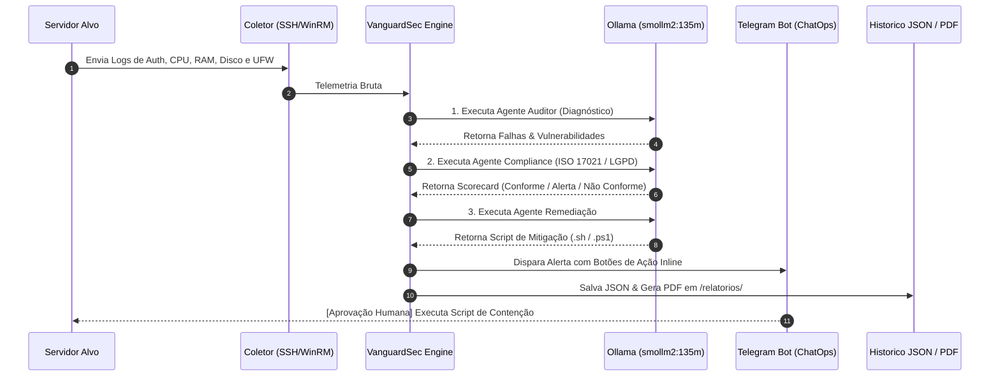

Aqui está o seu **`README.md`** completamente atualizado e padronizado. Ele unifica o fluxo visual do sistema com o modelo corporativo de **5 Camadas Enterprise (SOAR Pipeline)**, além de corrigir as URLs de clone e limpar artefatos de formatação do terminal:

```markdown
# 🛡️ VanguardSec AI — Global Command SOC

> **Next-Gen Autonomous Cyber Defense | Real-Time Remote Telemetry & Hardening**

---

## 📸 Preview & Resultados da Aplicação

Confira abaixo a interface do **VanguardSec AI** operando em tempo real com coleta de telemetria, diagnóstico dos Agentes de IA e métricas de resposta a incidentes:


<details>
<summary>🔍 Clique para ver mais detalhes do Painel e Scripts de Remediação</summary>

| Mapeamento MITRE ATT&CK | Scorecard & Guia de Remediação |
| :---: | :---: |
|  |  |

</details>

---

## 🏛️ Arquitetura em 5 Camadas (Enterprise SOAR Pipeline)

O **VanguardSec AI** é estruturado em uma arquitetura modular de 5 camadas, separando a coleta agentless, o processamento de IA local e a orquestração de resposta (SOAR/ChatOps):

```text
+-----------------------------------------------------------------------+
|  CAMADA 5: INTERFACE & CHATOPS (Experiência do Usuário & Resposta)   |
|  - Painel Streamlit (Visão SOC / ROI Executivo)                       |
|  - Bot Telegram Interativo (Botões de Ação Inline & Alertas)          |
+-----------------------------------------------------------------------+
                                  ▲
                                  │  [Ações de Resposta & Métricas]
                                  ▼
+-----------------------------------------------------------------------+
|  CAMADA 4: ORQUESTRAÇÃO & SOAR (Motor de Decisão & Playbooks)        |
|  - Gestor de Políticas (Nível 1: Self-Healing | Nível 2: Botões)      |
|  - Playbooks Automatizados (Bloqueio UFW, Kill Process, Quarentena)   |
|  - Matriz de Mitigação & Mapeamento MITRE ATT&CK                      |
+-----------------------------------------------------------------------+
                                  ▲
                                  │  [Análise Contextual & Score]
                                  ▼
+-----------------------------------------------------------------------+
|  CAMADA 3: PIPELINE MULTIAGENTE DE IA (Processamento Local)           |
|  - Agente Auditor (Diagnóstico de Ameaças & Anomalias)               |
|  - Agente Compliance (Mapeamento ISO/IEC 17021 & LGPD)                |
|  - Agente Remediação (Síntese de Scripts e Respostas)                 |
+-----------------------------------------------------------------------+
                                  ▲
                                  │  [Telemetria Normalizada]
                                  ▼
+-----------------------------------------------------------------------+
|  CAMADA 2: COLETOR & INGESTÃO AGENTLESS (Telemetria Remota)          |
|  - Módulo SSH (Linux) / WinRM (Windows)                               |
|  - Parser de Logs (auth.log, Syslog, Event Viewer)                    |
|  - Modo Simulação (Dry-Run / Dados Demo para Vendas)                  |
+-----------------------------------------------------------------------+
                                  ▲
                                  │  [Conexão Criptografada / Read-Only]
                                  ▼
+-----------------------------------------------------------------------+
|  CAMADA 1: INFRAESTRUTURA & SEGUROS (Bases de Dados & Cofre)          |
|  - Cofre de Credenciais Criptografado (Fernet/AES-256)                 |
|  - Histórico de Scans & Trilhas de Auditoria (JSON / Database)        |
|  - Gerador de Relatórios Executivos PDF (Assinado via Hash SHA-256)   |
+-----------------------------------------------------------------------+

```

---

## 🗺️ Topologia de Dados e Execução

O fluxo operacional descreve a jornada do dado desde a extração remota até o despacho de ações de contenção:

```text
                  +-----------------------------------+
                  |   SERVIDOR ALVO (Target Asset)   |
                  |  (172.30.0.168 - Ubuntu/Windows)  |
                  +-----------------+-----------------+
                                    |
                                    | [Telemetria via SSH / WinRM]
                                    | - /var/log/auth.log
                                    | - Uso de CPU, RAM, Disco
                                    | - Regras UFW / Portas Abertas
                                    v
+-----------------------------------------------------------------------+
|                         VANGUARDSEC AI SOC                            |
|                                                                       |
|  [Coletor Remoto] ──> [Normalizador de Métricas & Parser de Logs]     |
|                                 │                                     |
|                                 ▼                                     |
|           +-------------------------------------------+               |
|           |       PIPELINE DE AGENTES DE IA           |               |
|           |           (Ollama Engine)                 |               |
|           +---------------------+---------------------+               |
|                                 |                                     |
|          ┌──────────────────────┼──────────────────────┐              |
|          │                      │                      │              |
|          ▼                      ▼                      ▼              |
|  [Agente Auditor]    [Agente Compliance]    [Agente Remediacao]       |
|   Diagnóstico de      Scorecard de Regras      Geração de Scripts     |
|   Vulnerabilidades       (ISO/IEC 17021)        Bash / PowerShell     |
|          │                      │                      │              |
|          └──────────────────────┼──────────────────────┘              |
|                                 │                                     |
|                                 ▼                                     |
|              +-------------------------------------+                  |
|              |     MOTOR DE PERSISTÊNCIA & SOC     |                  |
|              +------------------+------------------+                  |
+---------------------------------|-------------------------------------+
                                  |
            ┌─────────────────────┼─────────────────────┐
            ▼                     ▼                     ▼
  [Relatório Executivo]   [Painel Streamlit]    [Integrações SIEM / Bot]
  PDFs gravados em        Metrics, Gauge &      Formato CEF & Botões de
  /relatorios/            Matriz de Riscos      Ação Direta no Telegram

```

### 🧬 Diagrama de Sequência e Decisão (Mermaid)



---

## 🏛️ Estrutura do Projeto

```text
vanguardsec-ai/
├── 🧠 agentes/                  # Camada de Inteligência Artificial
│   ├── agente_auditor.py        # Análise de vulnerabilidades e logs brutos
│   ├── agente_compliance.py     # Auditoria baseada em frameworks normativos
│   └── agente_remediacao.py     # Síntese de scripts executáveis de mitigação
│
├── 🔌 modulos/                  # Camada de Integração e Serviços
│   ├── coletor_ssh.py           # Conectividade e extração via SSH (Paramiko)
│   ├── coletor_winrm.py         # Conectividade e extração via WinRM (PyWinRM)
│   ├── chatops_bot.py           # Bot de resposta interativa para Telegram
│   ├── gerador_pdf.py           # Compilador de relatórios executivos em PDF
│   ├── notificador.py           # Despachador de alertas para webhooks SIEM
│   └── politicas.py             # Mapeamento e parsing da norma ISO/IEC 17021
│
├── 📁 docs/                     # Imagens e capturas do painel para documentação
├── 📁 relatorios/               # Armazenamento de PDFs gerados
├── 📊 app.py                    # Interface e Centro de Comando SOC (Streamlit)
├── 💾 historico_scans.json      # Base de dados em disco do histórico de scans
└── 📄 requirements.txt          # Dependências do projeto

```

---

## 🛠️ Requisitos e Instalação

### 1. Pré-requisitos

* Python 3.10+
* Ollama Engine instalado na máquina host.

### 2. Baixar o Modelo de IA

```bash
ollama pull smollm2:135m

```

### 3. Instalação do Projeto

```bash
git clone [https://github.com/DavidNonato23/vanguardsec-ai.git](https://github.com/DavidNonato23/vanguardsec-ai.git)
cd vanguardsec-ai

python -m venv venv

# No Windows PowerShell:
.\venv\Scripts\Activate.ps1

# No Linux/Mac:
source venv/bin/activate

pip install -r requirements.txt

```

### 4. Executando o SOC

```bash
python -m streamlit run app.py

```

```

---

