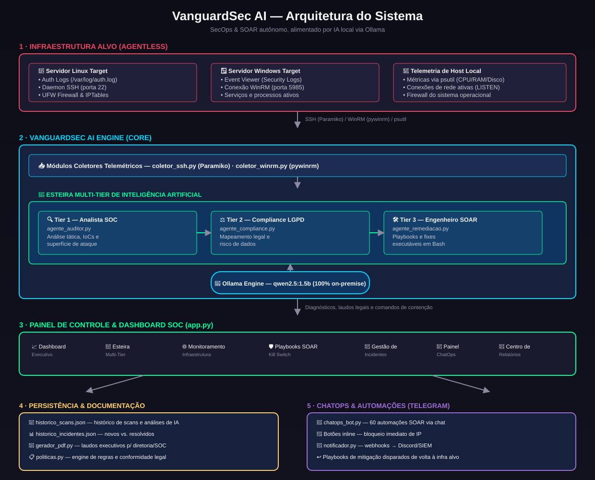
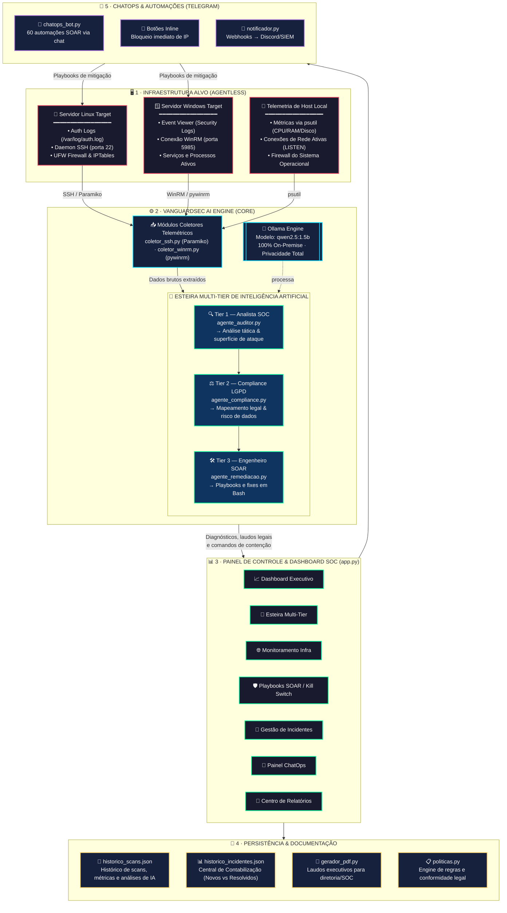
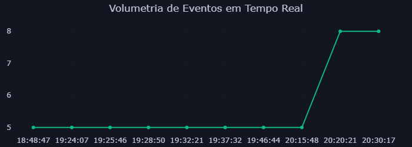

# 🛡️ VanguardSec AI — Global Command SOC & SOAR

**v1.0 — Plataforma autônoma de SecOps, Threat Intelligence e Resposta a Incidentes**

Plataforma autônoma de SecOps, Threat Intelligence e Resposta a Incidentes alimentada por Inteligência Artificial local via **Ollama**.

<p align="left">
  
  
  
  
</p>

---

## 📑 Sumário

- [Visão geral](#-visão-geral)
- [Arquitetura do sistema](#️-arquitetura-do-sistema)
- [Evidências de funcionamento](#-evidências-de-funcionamento)
- [Fluxo de engenharia](#-detalhamento-da-engenharia-de-fluxo)
- [Principais destaques](#-principais-destaques)
- [Estrutura do repositório](#-estrutura-do-repositório)
- [Pré-requisitos](#️-pré-requisitos)
- [Instalação e execução](#-guia-de-instalação-e-execução)
- [ChatOps via Telegram](#-configuração-do-chatops-telegram-opcional)
- [Autor](#-autor-e-desenvolvedor)
- [Licença](#-licença-e-uso)

---

## 🔎 Visão geral

O VanguardSec AI adota um modelo **agentless** (sem agentes instalados nos servidores monitorados). A comunicação ocorre de forma centralizada entre a engine de IA local (Ollama), os coletores telemétricos de infraestrutura, a interface executiva em Streamlit e os canais de resposta automatizada SOAR/ChatOps no Telegram.

---

## 🗺️ Arquitetura do sistema



<details>
<summary>Ver diagrama interativo (Mermaid)</summary>



</details>

---

## 📸 Evidências de funcionamento

Prints reais do sistema em execução, monitorando um servidor Ubuntu alvo (`192.168.15.10`) rodando em uma VM VirtualBox.

### 1. Infraestrutura alvo online

VM Ubuntu 26.04 LTS ligada e acessível na rede interna — o ativo que o VanguardSec AI monitora via SSH.


### 2. Varredura em execução

Agente consultando o servidor alvo em tempo real durante o polling.


### 3. Configuração do ativo monitorado

IP, usuário e autenticação do servidor Linux configurados no painel antes do polling.


### 4. Dashboard Executivo

Métricas de CPU, RAM, disco, tentativas de brute-force e histórico de scans das últimas 24h, populados com dados reais coletados do servidor.


### 5. Esteira Multi-Tier de IA

Diagnóstico completo gerado pelos 3 agentes (Analista SOC, Compliance LGPD e Engenheiro SOAR) rodando localmente via Ollama sobre a telemetria coletada.


### 6. Monitoramento de Infraestrutura

Classificação de rede, nível de risco e análise de tráfego (NTA) do host monitorado.


### 7. Playbooks SOAR

Script de contenção gerado automaticamente pelo Tier 3 (Engenheiro SOAR), pronto para execução via SSH.


### 8. Gestão e triagem de incidentes

Incidentes reais de brute-force detectados no host `192.168.15.10`, com severidade e status de triagem.


### 9. Kill Switch

Botões de contenção imediata (bloqueio de IP no UFW, reinício do SSH, alerta via Telegram) associados aos incidentes em triagem.


### 10. ChatOps via Telegram

Painel de configuração e disparo de alertas via webhook para o bot do Telegram.


### 11. Centro de Relatórios (PDF)

Emissão do laudo executivo em PDF diretamente pelo painel.


### 12. Relatório executivo gerado (exemplo real)

Laudo em PDF gerado automaticamente pelo sistema para o ativo `192.168.15.10`, com classificação de rede, volumetria de eventos, diagnóstico de compliance (LGPD/ISO 27001) e o playbook SOAR sugerido.

📄 [Ver exemplo de laudo em PDF](docs/Relatorio_SOC_192_168_15_10_20260826_211935.pdf)




---

## 🔄 Detalhamento da Engenharia de Fluxo

1. **Sondagem Telemétrica (Inbound Agentless):** o módulo realiza conexões seguras sem agente (SSH via Paramiko para Linux e pywinrm para Windows) e consome dados dinâmicos da máquina local via `psutil` (uso de CPU, RAM, disco e serviços escutando portas LISTEN).

2. **Processamento Multi-Tier (Local LLM):** a telemetria passa sequencialmente pelo pipeline no Ollama local usando o modelo `qwen2.5:1.5b`:
   - **Tier 1 (Analista SOC):** extrai IoCs (IPs atacantes, portas afetadas e contagem de investidas brute-force).
   - **Tier 2 (Compliance):** audita o impacto legal sob a diretriz da LGPD e frameworks de segurança.
   - **Tier 3 (Engenheiro SOAR):** compila o playbook de contenção executável (`sudo ufw deny`, reinício de serviços).

3. **Gestão e Contabilização de Incidentes:** os dados processados alimentam `modulos/gestor_incidentes.py`, separando de forma inteligente os **Novos Incidentes** (em triagem) do **Histórico Contabilizado** (mitigados e resolvidos).

4. **Apresentação & Notificação (Outbound):** os diagnósticos alimentam a interface web Streamlit, populam as bases de persistência JSON, geram relatórios executivos em PDF com gráficos Plotly embutidos e despacham alertas via ChatOps.

5. **Remediação SOAR Bidirecional (Kill Switch):** o bloqueio acionado por botões de emergência na tela — ou por botão inline no celular — injeta a regra diretamente no firewall do servidor alvo para contenção imediata da ameaça.

---

## 🎨 Principais destaques

| Destaque | Descrição |
|---|---|
| 📊 **Dashboard Executivo Dinâmico** | Interface intuitiva com gráficos atualizados em tempo real: métricas de hardware, portas em escuta e histórico acumulado de exames. |
| 🛑 **Painel de Resposta Imediata (Kill Switch)** | Botões dedicados para isolar servidores, derrubar conexões TCP ativas ou bloquear portas sensíveis em 1 clique via SSH. |
| 🗂️ **Central de Incidentes & Histórico** | Sistema de tickets integrado que contabiliza separadamente novas ameaças e o histórico de incidentes tratados. |
| 🧠 **Esteira Multi-Tier de IA On-Premise** | Três camadas encadeadas rodando localmente via Ollama (`qwen2.5:1.5b`), garantindo sigilo total dos logs sem envio de dados a APIs externas. |
| 📲 **Automação ChatOps Telegram** | Bot interativo com 60 automações e botões inline para bloqueio de IPs com 1 clique no celular. |
| 📄 **Relatórios Executivos em PDF** | Geração de laudos completos prontos para diretoria/auditoria, com gráficos visuais e pareceres da IA embutidos. |

---

## 📂 Estrutura do repositório

```
VanguardSec-AI/
├── agentes/
│   ├── agente_auditor.py         # Tier 1: Analista de SOC (Triagem & IoCs)
│   ├── agente_compliance.py      # Tier 2: Especialista em Riscos e LGPD
│   └── agente_remediacao.py      # Tier 3: Engenheiro SOAR (Playbooks & Fixes)
├── modulos/
│   ├── coletor_ssh.py            # Coleta remota Linux via Paramiko
│   ├── coletor_winrm.py          # Coleta remota Windows via pywinrm
│   ├── gestor_incidentes.py      # Gestão, contabilização e workflow de tickets
│   ├── gerador_pdf.py            # Geração de laudos executivos em PDF com Plotly
│   ├── chatops_bot.py            # Bot Telegram com 60 automações SOAR
│   ├── notificador.py            # Disparo de Webhooks (Discord / SIEM)
│   └── politicas.py              # Engine de regras e conformidade legal
├── docs/
│   ├── arquitetura.svg                              # Diagrama de arquitetura do sistema
│   ├── Captura de tela 2026-08-26 *.png              # Prints reais do sistema em execução
│   ├── grafico_volumetria.png                        # Gráfico de volumetria de eventos
│   └── Relatorio_SOC_192_168_15_10_20260826_211935.pdf  # Laudo executivo real gerado pelo sistema
├── start.bat                     # Script unificado de instalação e auto-boot
├── app.py                        # Aplicação principal (Dashboard Streamlit + Kill Switch)
├── historico_scans.json          # Base de dados local do histórico de exames
├── historico_incidentes.json     # Base de dados de incidentes e status de triagem
├── requirements.txt              # Dependências de bibliotecas Python
└── README.md                     # Documentação técnica do sistema
```

---

## 🛠️ Pré-requisitos

- **Sistema Operacional:** Windows, Linux ou macOS.
- **Python:** versão 3.10 ou superior.
- **Ollama Engine:** instalado e rodando localmente (`http://localhost:11434`).
- **Modelo LLM Local:** `qwen2.5:1.5b`.
- **Conectividade Remota:** SSH habilitado nos alvos Linux ou WinRM nos alvos Windows.

---

## 🚀 Guia de Instalação e Execução

### Opção 1 — Execução automática via Windows (recomendado)

Basta dar um duplo clique no arquivo `start.bat`, na raiz do projeto. O script automatizado irá:

1. Validar a presença do Python no sistema.
2. Criar e ativar o ambiente virtual (`venv`).
3. Instalar/atualizar todas as dependências do `requirements.txt`.
4. Iniciar o painel Streamlit e abrir o navegador em `http://localhost:8501`.

### Opção 2 — Instalação manual via terminal

```bash
# 1. Clonar o repositório
git clone https://github.com/DavidNonato23/vanguardsec-ai.git
cd vanguardsec-ai

# 2. Criar e ativar o ambiente virtual
python -m venv venv

# Windows (PowerShell)
Set-ExecutionPolicy -ExecutionPolicy Bypass -Scope Process
.\venv\Scripts\activate

# Linux / macOS
source venv/bin/activate

# 3. Instalar as dependências
pip install -r requirements.txt

# 4. Baixar o modelo no Ollama
ollama pull qwen2.5:1.5b

# 5. Iniciar a aplicação
streamlit run app.py
```

Acesse o painel executivo pelo navegador em: **http://localhost:8501**

---

## 📱 Configuração do ChatOps Telegram (opcional)

Para receber alertas operacionais e executar os playbooks SOAR pelo smartphone:

1. Configure o token nas variáveis de ambiente do sistema, ou diretamente na aba **📱 Configuração ChatOps** do painel web:
   - `TELEGRAM_BOT_TOKEN` — token gerado pelo [@BotFather](https://t.me/BotFather).
   - `TELEGRAM_ALLOWED_USER_ID` — seu ID de usuário no Telegram (obtido via [@userinfobot](https://t.me/userinfobot)).
2. Para ativar o bot em segundo plano, execute:

```bash
python -m modulos.chatops_bot
```

Ao detectar ataques, o bot enviará alertas em tempo real com botões interativos para aplicação imediata de regras no firewall UFW.

---

## 👨‍💻 Autor e Desenvolvedor

**Idealização, Arquitetura & Engenharia:** David Nonato

- GitHub: [@DavidNonato23](https://github.com/DavidNonato23)
- Projeto: VanguardSec AI — Global Command SOC & SOAR v1.0

---

## 📄 Licença e Uso

Solução de arquitetura aberta para SecOps, inteligência de ameaças e mitigação autônoma de incidentes. Sinta-se à vontade para clonar, personalizar e expandir.

**VanguardSec AI v1.0** — Developed by David Nonato
