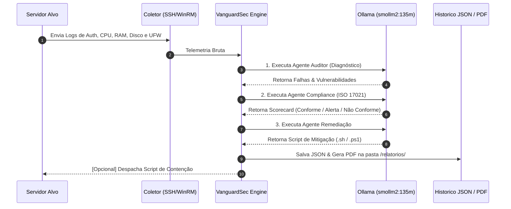

---

### `README.md`

```markdown
# 🛡️ VanguardSec AI — Global Command SOC

> **Next-Gen Autonomous Cyber Defense | Real-Time Remote Telemetry & Hardening**

O **VanguardSec AI** é um painel de Security Operations Center (SOC) autônomo projetado para auditoria contínua, análise de postura de segurança e mitigação remota de ameaças em ambientes heterogêneos (Ubuntu Linux e Windows Server).

---

## 🗺️ Topologia e Arquitetura do Sistema

O diagrama abaixo ilustra o fluxo de dados desde a coleta de telemetria no servidor auditado até o processamento pela tripla camada de agentes de IA locais e geração de relatórios de compliance:

```text
                  +-----------------------------------+
                  |   SERVIDOR ALVO (Target Asset)   |
                  |  (172.30.0.168 - Ubuntu/Windows)  |
                  +-----------------+-----------------+
                                    |
                                    | [Telemetria via SSH / WinRM]
                                    | - /var/log/auth.log
                                    | - Uso de CPU, RAM, Disco
                                    | - Regras UFW / Portas Abertas
                                    v
+-----------------------------------------------------------------------+
|                         VANGUARDSEC AI SOC                            |
|                                                                       |
|  [Coletor Remoto] ──> [Normalizador de Métricas & Parser de Logs]     |
|                                 │                                     |
|                                 ▼                                     |
|           +-------------------------------------------+               |
|           |       PIPELINE DE AGENTES DE IA           |               |
|           |           (Ollama Engine)                 |               |
|           +---------------------+---------------------+               |
|                                 |                                     |
|          ┌──────────────────────┼──────────────────────┐              |
|          │                      │                      │              |
|          ▼                      ▼                      ▼              |
|  [Agente Auditor]    [Agente Compliance]    [Agente Remediacao]       |
|   Diagnóstico de      Scorecard de Regras      Geração de Scripts     |
|   Vulnerabilidades       (ISO/IEC 17021)        Bash / PowerShell     |
|          │                      │                      │              |
|          └──────────────────────┼──────────────────────┘              |
|                                 │                                     |
|                                 ▼                                     |
|              +-------------------------------------+                  |
|              |     MOTOR DE PERSISTÊNCIA & SOC     |                  |
|              +------------------+------------------+                  |
+---------------------------------|-------------------------------------+
                                  |
            ┌─────────────────────┼─────────────────────┐
            ▼                     ▼                     ▼
  [Relatório Executivo]   [Painel Streamlit]    [Integrações SIEM]
  PDFs gravados em        Metrics, Gauge &      Formato CEF e
  /relatorios/            Matriz de Riscos      Webhooks Ativos

```

### 🧬 Diagrama de Sequência e Decisão (Mermaid)



---

## 🏛️ Estrutura de Camadas da Aplicação

O projeto adota uma arquitetura modularizada para garantir isolamento de responsabilidades:

```text
vanguardsec-ai/
├── 🧠 agentes/                  # Camada de Inteligência Artificial
│   ├── agente_auditor.py        # Análise de vulnerabilidades e logs brutos
│   ├── agente_compliance.py     # Auditoria baseada em frameworks normativos
│   └── agente_remediacao.py     # Síntese de scripts executáveis de mitigação
│
├── 🔌 modulos/                  # Camada de Integração e Serviços
│   ├── coletor_ssh.py           # Conectividade e extração via SSH (Paramiko)
│   ├── coletor_winrm.py         # Conectividade e extração via WinRM (PyWinRM)
│   ├── gerador_pdf.py           # Compilador de relatórios executivos em PDF
│   ├── notificador.py           # Despachador de alertas para webhooks SIEM
│   └── politicas.py             # Mapeamento e parsing da norma ISO/IEC 17021
│
├── 📁 relatorios/               # Armazenamento persistente de PDFs gerados
├── 📊 app.py                    # Interface e Centro de Comando SOC (Streamlit)
├── 💾 historico_scans.json      # Base de dados em disco do histórico de scans
└── 📄 requirements.txt          # Dependências do projeto

```

---

## 🚀 Funcionalidades Chave

* **Telemetria de Ativos Remotos:** Monitoramento contínuo de CPU, memória, disco e serviços expostos.
* **Tripla IA Local e Privada:** Execução 100% offline via Ollama (`smollm2:135m`), garantindo que dados confidenciais de infraestrutura não saiam da sua rede.
* **Mapeamento Normativo:** Auditoria de conformidade automática alinhada à **ISO/IEC 17021**.
* **Auto-Remediação Automatizada:** Geração e despacho de scripts de mitigação em tempo real.
* **Geração Automática de Artefatos:** Criação de relatórios executivos em PDF e logs no padrão **SIEM (CEF)**.

---

## 🛠️ Requisitos e Instalação

### 1. Pré-requisitos

* Python 3.10+
* Ollama Engine instalado na máquina host.

### 2. Baixar o Modelo de IA

```bash
ollama pull smollm2:135m

```

### 3. Instalação do Projeto

```bash
git clone [https://github.com/seu-usuario/vanguardsec-ai.git](https://github.com/seu-usuario/vanguardsec-ai.git)
cd vanguardsec-ai

python -m venv venv
source venv/bin/activate  # No Windows: venv\Scripts\activate

pip install -r requirements.txt

```

### 4. Executando o SOC

```bash
streamlit run app.py

```

```

```