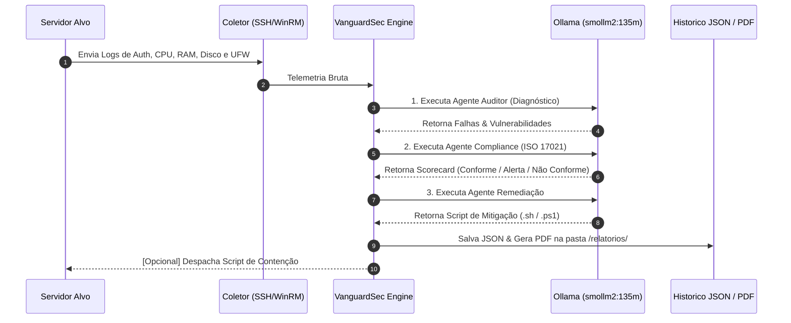

Aqui está o seu **`README.md`** completo e atualizado com uma seção **`📸 Preview & Resultados da Aplicação`** dedicada para você inserir as imagens do dashboard!

Ela traz um layout organizado com badges explicativas e espaço para você colocar de 1 a 3 prints do sistema.

---

### `README.md`

```markdown
# 🛡️ VanguardSec AI — Global Command SOC

> **Next-Gen Autonomous Cyber Defense | Real-Time Remote Telemetry & Hardening**

---

## 📸 Preview & Resultados da Aplicação

Confira abaixo a interface do **VanguardSec AI** operando em tempo real com coleta de telemetria, diagnóstico dos Agentes de IA e métricas de resposta a incidentes:


<details>
<summary>🔍 Clique para ver mais detalhes do Painel e Scripts de Remediação</summary>

| Mapeamento MITRE ATT&CK | Scorecard & Guia de Remediação |
| :---: | :---: |
|  |  |

</details>

---

## 🗺️ Topologia e Arquitetura do Sistema

O diagrama abaixo ilustra o fluxo de dados desde a coleta de telemetria no servidor auditado até o processamento pela tripla camada de agentes de IA locais e geração de relatórios de compliance:

```text
                  +-----------------------------------+
                  |   SERVIDOR ALVO (Target Asset)   |
                  |  (172.30.0.168 - Ubuntu/Windows)  |
                  +-----------------+-----------------+
                                    |
                                    | [Telemetria via SSH / WinRM]
                                    | - /var/log/auth.log
                                    | - Uso de CPU, RAM, Disco
                                    | - Regras UFW / Portas Abertas
                                    v
+-----------------------------------------------------------------------+
|                         VANGUARDSEC AI SOC                            |
|                                                                       |
|  [Coletor Remoto] ──> [Normalizador de Métricas & Parser de Logs]     |
|                                 │                                     |
|                                 ▼                                     |
|           +-------------------------------------------+               |
|           |       PIPELINE DE AGENTES DE IA           |               |
|           |           (Ollama Engine)                 |               |
|           +---------------------+---------------------+               |
|                                 |                                     |
|          ┌──────────────────────┼──────────────────────┐              |
|          │                      │                      │              |
|          ▼                      ▼                      ▼              |
|  [Agente Auditor]    [Agente Compliance]    [Agente Remediacao]       |
|   Diagnóstico de      Scorecard de Regras      Geração de Scripts     |
|   Vulnerabilidades       (ISO/IEC 17021)        Bash / PowerShell     |
|          │                      │                      │              |
|          └──────────────────────┼──────────────────────┘              |
|                                 │                                     |
|                                 ▼                                     |
|              +-------------------------------------+                  |
|              |     MOTOR DE PERSISTÊNCIA & SOC     |                  |
|              +------------------+------------------+                  |
+---------------------------------|-------------------------------------+
                                  |
            ┌─────────────────────┼─────────────────────┐
            ▼                     ▼                     ▼
  [Relatório Executivo]   [Painel Streamlit]    [Integrações SIEM]
  PDFs gravados em        Metrics, Gauge &      Formato CEF e
  /relatorios/            Matriz de Riscos      Webhooks Ativos

```

### 🧬 Diagrama de Sequência e Decisão (Mermaid)



---

## 🏛️ Estrutura de Camadas da Aplicação

```text
vanguardsec-ai/
├── 🧠 agentes/                  # Camada de Inteligência Artificial
│   ├── agente_auditor.py        # Análise de vulnerabilidades e logs brutos
│   ├── agente_compliance.py     # Auditoria baseada em frameworks normativos
│   └── agente_remediacao.py     # Síntese de scripts executáveis de mitigação
│
├── 🔌 modulos/                  # Camada de Integração e Serviços
│   ├── coletor_ssh.py           # Conectividade e extração via SSH (Paramiko)
│   ├── coletor_winrm.py         # Conectividade e extração via WinRM (PyWinRM)
│   ├── gerador_pdf.py           # Compilador de relatórios executivos em PDF
│   ├── notificador.py           # Despachador de alertas para webhooks SIEM
│   └── politicas.py             # Mapeamento e parsing da norma ISO/IEC 17021
│
├── 📁 docs/                     # Imagens e capturas do painel para documentação
├── 📁 relatorios/               # Armazenamento de PDFs gerados
├── 📊 app.py                    # Interface e Centro de Comando SOC (Streamlit)
├── 💾 historico_scans.json      # Base de dados em disco do histórico de scans
└── 📄 requirements.txt          # Dependências do projeto

```

---

## 🛠️ Requisitos e Instalação

### 1. Pré-requisitos

* Python 3.10+
* Ollama Engine instalado na máquina host.

### 2. Baixar o Modelo de IA

```bash
ollama pull smollm2:135m

```

### 3. Instalação do Projeto

```bash
git clone [https://github.com/DavidNonato23/anguardSec-AI-SOC-aut-nomo-com-IA-local-monitoramento-de-servidores-e-auditoria-de-compliance.git](https://github.com/DavidNonato23/anguardSec-AI-SOC-aut-nomo-com-IA-local-monitoramento-de-servidores-e-auditoria-de-compliance.git)
cd vanguardsec-ai

python -m venv venv
source venv/bin/activate  # No Windows: .\venv\Scripts\Activate.ps1

pip install -r requirements.txt

```

### 4. Executando o SOC

```bash
python -m streamlit run app.py

```

```

---

### Passo a Passo para adicionar a imagem:

1. Crie uma pasta chamada **`docs`** no seu projeto.
2. Salve a print da tela com o nome **`dashboard.png`** dentro dessa pasta (`docs/dashboard.png`).
3. Suba para o GitHub:
   ```powershell
   git add docs/dashboard.png README.md
   git commit -m "docs: adiciona secao de preview de resultados no README"
   git push

```