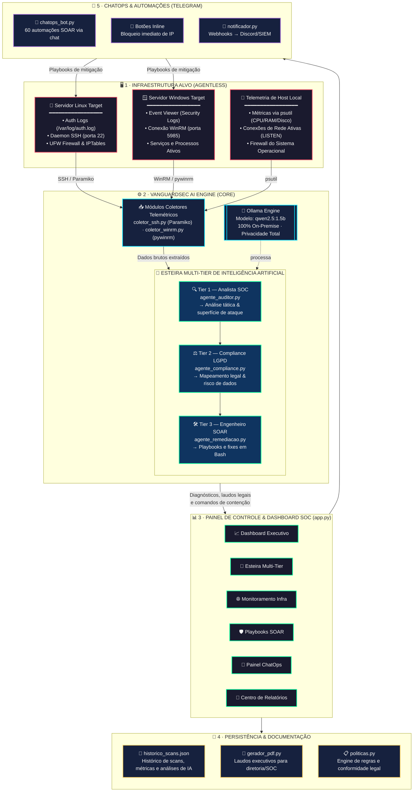

# 🛡️ VanguardSec AI — Global Command SOC & SOAR (v1.0)

**Next-Gen Autonomous Cyber Defense Platform**

Plataforma autônoma de SecOps, Threat Intelligence e Resposta a Incidentes alimentada por Inteligência Artificial local via Ollama.

---

## 👨‍💻 Autor e Desenvolvedor

**Idealização, Arquitetura & Engenharia:** David Nonato

- GitHub: [@DavidNonato23](https://github.com/DavidNonato23)
- Projeto: VanguardSec AI — Global Command SOC & SOAR v1.0

---

## 🗺️ Topologia e Arquitetura do Sistema

<p align="center">
  
</p>

A topologia do VanguardSec AI adota um modelo **agentless** (sem agentes instalados nos servidores monitorados).

A comunicação ocorre de forma centralizada entre a engine de IA local (Ollama), os coletores telemétricos de infraestrutura, a interface executiva em Streamlit e os canais de resposta automatizada SOAR/ChatOps no Telegram.



<details>
<summary>📄 Ver diagrama original em ASCII (fallback)</summary>

```
===================================================================================================================
                                     VANGUARDSEC AI — ARQUITETURA COMPLETA DO SISTEMA
===================================================================================================================

  +-------------------------------------------------------------------------------------------------------------+
  |                                           1. INFRAESTRUTURA ALVO (AGENTLESS)                                |
  |                                                                                                             |
  |   [ Servidor Linux Target ]      [ Servidor Windows Target ]        [ Telemetria de Host Local ]            |
  |   • Auth Logs (/var/log/auth.log)| • Event Viewer (Security Logs)   | • Métricas de Recursos (psutil)       |
  |   • Daemon SSH (Porta 22)        | • Conexão WinRM (Porta 5985)     | • Conexões de Rede Ativas (LISTEN)    |
  |   • UFW Firewall & Tabela IPTables| • Serviços e Processos Ativos   | • Firewall do Sistema Operacional     |
  +------------------------------------------------------+------------------------------------------------------+
                                                         ^
                                                         | (A) Coleta de Telemetria sem Agente (SSH / WinRM)
                                                         | (B) Execução de Script de Mitigação & Remediação SOAR
                                                         v
  +------------------------------------------------------+------------------------------------------------------+
  |                                           2. VANGUARDSEC AI ENGINE (CORE)                                   |
  |                                                                                                             |
  |   +-----------------------------------------------------------------------------------------------------+   |
  |   |                                     MÓDULOS COLETORES TELEMÉTRICOS                                  |   |
  |   |      • modulos/coletor_ssh.py (Paramiko)               • modulos/coletor_winrm.py (pywinrm)            |   |
  |   +--------------------------------------------------+--------------------------------------------------+   |
  |                                                      |                                                      |
  |                                                      v (Dados Brutos Extraídos)                             |
  |   +-----------------------------------------------------------------------------------------------------+   |
  |   |                            ESTEIRA MULTI-TIER DE INTELIGÊNCIA ARTIFICIAL                            |   |
  |   |                                                                                                     |   |
  |   |   • Tier 1: Analista SOC        (agentes/agente_auditor.py)     -> Análise Tática e Superfície de Ataque|   |
  |   |   • Tier 2: Compliance LGPD     (agentes/agente_compliance.py)  -> Mapeamento Legal e Risco de Dados   |   |
  |   |   • Tier 3: Engenheiro SOAR     (agentes/agente_remediacao.py)  -> Geração de Playbooks e Fixes em Bash|   |
  |   |                                                                                                     |   |
  |   |   [ Motor Local de LLM ] -> Ollama Engine (Modelo: qwen2.5:1.5b) | 100% On-Premise (Privacidade Total) |   |
  |   +--------------------------------------------------+--------------------------------------------------+   |
  +------------------------------------------------------+------------------------------------------------------+
                                                         |
                                                         | (Diagnósticos, Laudos Legais e Comandos de Contenção)
                                                         v
  +------------------------------------------------------+------------------------------------------------------+
  |                                     3. PAINEL DE CONTROLE & DASHBOARD SOC                                   |
  |                                                                                                             |
  |   [ Interface Web Streamlit — app.py ]                                                                      |
  |   • 📊 Dashboard Executivo  : Telemetria em tempo real (CPU, RAM, Disco) e histograma de histórico          |
  |   • 🔍 Esteira Multi-Tier   : Visualização paralela dos diagnósticos das 3 camadas de IA                    |
  |   • 🌐 Monitoramento Infra  : Leitura viva de portas LISTEN e regras de firewall UFW                         |
  |   • 🛡️ Playbooks SOAR       : Botões de contenção rápida (Bloqueio UFW, Restart SSH, Kill-Switch)           |
  |   • 📱 Painel ChatOps       : Configuração de credenciais do Bot Telegram em tempo de execução              |
  |   • 📄 Centro de Relatórios  : Emissão automatizada de laudos executivos em PDF                            |
  +------------------------------------------------------+------------------------------------------------------+
                                                         |
                   +-------------------------------------+-------------------------------------+
                   |                                                                           |
                   v                                                                           v
  +------------------------------------------------------+   +--------------------------------------------------+
  |            4. PERSISTÊNCIA & DOCUMENTAÇÃO            |   |          5. CHATOPS & AUTOMAÇÕES (TELEGRAM)      |
  |                                                      |   |                                                  |
  | • Histórico de Scans : historico_scans.json          |   | • Módulo Principal : modulos/chatops_bot.py      |
  |   (Registra data, host, métricas e análises de IA)   |   | • 60 Automações    : Comandos SOAR via chat      |
  | • Gerador de PDF     : modulos/gerador_pdf.py        |   | • Botões Inline    : Bloqueio imediato de IP     |
  |   (Gera laudos estruturados para diretoria e SOC)    |   | • Alerta de Incidente: Notificação Push Webhook   |
  | • Engine de Regras   : modulos/politicas.py          |   |   (modulos/notificador.py -> Discord/SIEM)      |
  +------------------------------------------------------+   +--------------------------------------------------+
```

</details>

### 🔄 Detalhamento da Engenharia de Fluxo

1. **Sondagem Telemétrica (Inbound Agentless):** O módulo realiza conexões seguras sem agente (SSH via Paramiko para Linux e pywinrm para Windows) e consome dados dinâmicos da máquina local via psutil (uso de CPU, RAM, disco e serviços escutando portas LISTEN).

2. **Processamento Multi-Tier (Local LLM):** A telemetria passa sequencialmente pelo pipeline no Ollama local usando o modelo `qwen2.5:1.5b`:
   - **Tier 1 (Analista SOC):** Extrai IoCs (IPs atacantes, portas afetadas e contagem de investidas brute-force).
   - **Tier 2 (Compliance):** Audita o impacto legal sob a diretriz da LGPD e frameworks de segurança.
   - **Tier 3 (Engenheiro SOAR):** Compila o Playbook de contenção executável (`sudo ufw deny` e reinício de serviços).

3. **Apresentação & Notificação (Outbound):** Os diagnósticos alimentam a interface web Streamlit, alimentam a base `historico_scans.json`, geram relatórios executivos em PDF e despacham alertas para o Telegram.

4. **Remediação SOAR Bidirecional:** O bloqueio acionado no painel ou via botão inline no celular injeta a regra diretamente no firewall do servidor alvo para contenção imediata da ameaça.

---

## 🎨 Principais Destaques

- **Dashboard Executivo Dinâmico:** Interface intuitiva com gráficos atualizados em tempo real contendo métricas de hardware, portas em escuta e histórico acumulado de exames.
- **Esteira Multi-Tier de IA On-Premise:** Três camadas encadeadas rodando localmente via Ollama (`qwen2.5:1.5b`), garantindo sigilo total dos logs sem envio de dados para APIs externas.
- **Automação ChatOps Telegram (60 Automações):** Bot interativo com suporte a comandos rápidos e botões inline para bloqueio de IPs e reinício de serviços com 1 clique no celular.
- **Relatórios Executivos & Logs SIEM:** Geração de laudos completos em PDF prontos para diretoria/auditoria e exportação de webhooks para integração com SIEM/Discord/Slack.

---

## 📂 Estrutura do Repositório

```
VanguardSec-AI/
├── agentes/
│   ├── agente_auditor.py         # Tier 1: Analista de SOC (Triagem & IoCs)
│   ├── agente_compliance.py      # Tier 2: Especialista em Riscos e LGPD
│   └── agente_remediacao.py      # Tier 3: Engenheiro SOAR (Playbooks & Fixes)
├── modulos/
│   ├── coletor_ssh.py            # Coleta remota Linux via Paramiko
│   ├── coletor_winrm.py          # Coleta remota Windows via pywinrm
│   ├── gerador_pdf.py            # Geração de laudos executivos em PDF
│   ├── chatops_bot.py            # Bot Telegram com 60 automações SOAR
│   ├── notificador.py            # Disparo de Webhooks (Discord / SIEM)
│   └── politicas.py              # Engine de regras e conformidade legal
├── start.bat                     # Script unificado de instalação e auto-boot
├── app.py                        # Aplicação principal (Dashboard Streamlit)
├── historico_scans.json          # Base de dados local do histórico de exames
├── requirements.txt              # Dependências de bibliotecas Python
└── README.md                     # Documentação técnica do sistema
```

---

## 🛠️ Pré-requisitos

- **Sistema Operacional:** Windows, Linux ou macOS.
- **Python:** Versão 3.10 ou superior.
- **Ollama Engine:** Instalado e rodando localmente (`http://localhost:11434`).
- **Modelo LLM Local:** `qwen2.5:1.5b`
- **Conectividade Remota:** SSH habilitado nos alvos Linux ou WinRM nos alvos Windows.

---

## 🚀 Guia de Instalação e Execução

### Opção 1: Execução Automática via Windows (Recomendado)

Basta dar um duplo clique no arquivo `start.bat` localizado na raiz do projeto. O script automatizado irá:

1. Validar a presença do Python no sistema.
2. Criar e ativar o ambiente virtual (`venv`).
3. Instalar/atualizar todas as dependências do `requirements.txt`.
4. Iniciar o painel Streamlit e abrir o navegador em `http://localhost:8501`.

### Opção 2: Instalação Manual via Terminal

```bash
# 1. Clonar o repositório
git clone https://github.com/DavidNonato23/vanguardsec-ai.git
cd vanguardsec-ai

# 2. Criar e ativar o ambiente virtual
python -m venv venv

# Windows (PowerShell)
Set-ExecutionPolicy -ExecutionPolicy Bypass -Scope Process
.\venv\Scripts\activate

# Linux / macOS
source venv/bin/activate

# 3. Instalar as dependências
pip install -r requirements.txt

# 4. Baixar o modelo no Ollama
ollama pull qwen2.5:1.5b

# 5. Iniciar a aplicação
streamlit run app.py
```

Acesse o painel executivo pelo navegador em: `http://localhost:8501`

---

## 📱 Configuração do ChatOps Telegram (Opcional)

Para receber alertas operacionais e executar os playbooks SOAR pelo smartphone:

1. Configure o token nas variáveis de ambiente do sistema ou diretamente na aba **📱 Configuração ChatOps** do painel web:
   - `TELEGRAM_BOT_TOKEN`: Token gerado pelo [@BotFather](https://t.me/BotFather).
   - `TELEGRAM_ALLOWED_USER_ID`: Seu ID de usuário no Telegram (obtido via [@userinfobot](https://t.me/userinfobot)).

2. Para ativar o bot em segundo plano, execute:

```bash
python -m modulos.chatops_bot
```

Ao detectar ataques, o bot enviará alertas em tempo real com botões interativos para aplicação imediata de regras no firewall UFW.

---

## 📄 Licença e Uso

Solução de arquitetura aberta para SecOps, inteligência de ameaças e mitigação autônoma de incidentes. Sinta-se à vontade para clonar, personalizar e expandir.

---

**VanguardSec AI v1.0** — Developed by David Nonato
